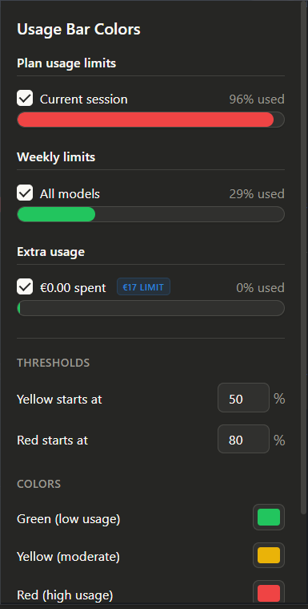

# Claude Usage Bar Colors

A Chrome/Edge extension that makes Claude.ai's usage limit bars change color based on how much you've used — so you can tell at a glance if you're running low.

## Features

- **Dynamic colors** — bars change from green to yellow to red as usage increases
- **Customizable thresholds** — set your own breakpoints for when colors change
- **Custom colors** — pick any color for each level
- **Per-bar toggle** — choose which bars to colorize (Current session, All models, Extra usage)
- **Live popup** — see your real usage with color-coded bars right from the extension icon
- **Extra usage detection** — shows if extra usage is ON/OFF, Unlimited, or has a spending limit
- **Auto-refresh** — popup updates every 3 seconds without closing
- **No blue flash** — bars are hidden until colored, so you never see the default blue

## Default Thresholds

| Color | Range | Meaning |
|-------|-------|---------|
| Green | 0–49% | You're good |
| Yellow | 50–79% | Getting there |
| Red | 80–100% | Running low |

## Install

### From GitHub (free)

1. Download the [latest release](../../releases/latest) or click **Code > Download ZIP**
2. Unzip the folder
3. Open `chrome://extensions` (Chrome) or `edge://extensions` (Edge)
4. Enable **Developer mode** (toggle in top-right)
5. Click **Load unpacked** and select the unzipped folder
6. Go to [claude.ai/settings/usage](https://claude.ai/settings/usage) and see it in action

### From Edge Add-ons (coming soon)

Will be available for free on the Microsoft Edge Add-ons store.

## Usage

1. Click the extension icon in your toolbar to open the popup
2. See your live usage with color-coded bars
3. Toggle individual bars on/off with the checkboxes
4. Adjust thresholds and colors in the settings section
5. Click **Save** to apply changes

## Privacy

This extension:
- Only runs on `claude.ai`
- Only reads usage percentages from the page DOM
- Stores your settings locally via `chrome.storage.sync`
- Does **not** collect, transmit, or share any data
- Has no analytics, tracking, or external network requests

See [PRIVACY.md](PRIVACY.md) for the full privacy policy.

## Built With

- Manifest V3
- Vanilla JavaScript
- Zero dependencies

## License

MIT
